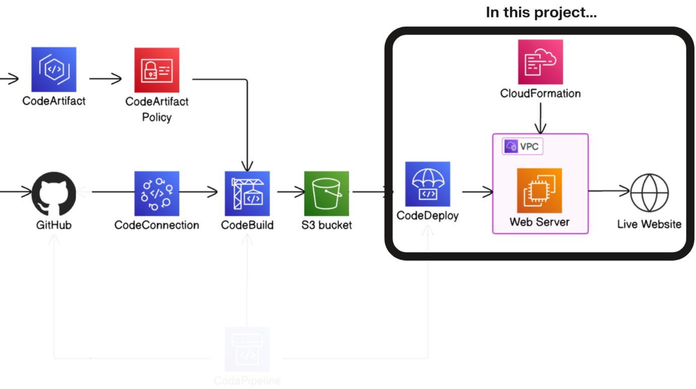
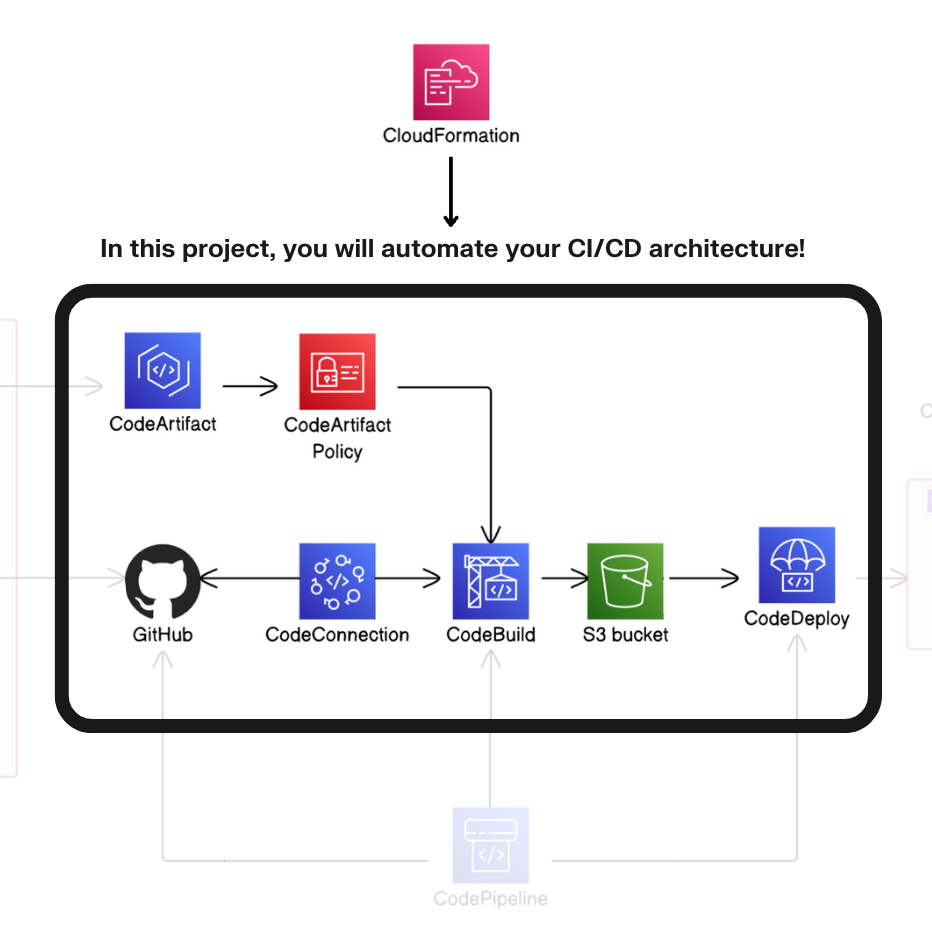
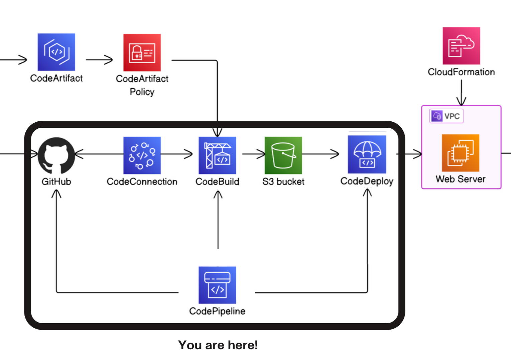

# Hi, I'm Bradley Davel 👋
**`DevOps | Cloud Security | Infrastructure Automation`**

### 🚀 About Me  
I'm a **DevOps Engineer** from South Africa, passionate about building scalable infrastructure, automating everything, and securing cloud environments. My journey bridges hands-on system administration, full-stack development, and **cloud-native DevOps practices** across AWS, Docker, Kubernetes, and CI/CD pipelines.  

Currently:  
- 🔭 Building advanced **DevOps and Cloud Security labs** (AWS, VMware, pfSense, CI/CD).  
- 🌱 Preparing for the **AWS Certified DevOps Engineer – Professional** exam.  
- 🛡️ Applying my **SOC + Cloud Security background** to real-world DevOps pipelines.
   
# 
### 🛠️ Languages & Tools

 

# 

## 🚀 Project Showcase

<table>
  <tr>
    <td align="center" width="33%">
      
       
      <b>Deploy a Web App with CodeDeploy</b> 
      Day 5 - Deploy a Web App 
      🔗 <a href="https://github.com/BradleyDavel/AWS-DevOps-Project_Day5">Repo</a>
       
      Tags: AWS, CodeBuild, code deploy
    </td>
    <td align="center" width="33%">
      
       
      <b>Day 6 — IaC with CloudFormation</b> 
      Infrastructure as Code with CloudFormation templates, dependency graphs, and automated resource provisioning. 
      🔗 <a href="https://github.com/BradleyDavel/AWS-DevOps-Project_Day6">Repo</a>
       
      Tags: AWS, CloudFormation, IaC
    </td>
    <td align="center" width="33%">
      
       
      <b>Day 7 — Full CI/CD Pipeline</b> 
      End-to-end pipeline with GitHub → CodePipeline → CodeBuild → CodeDeploy, artifacts chaining, and rollback safety. 
      🔗 <a href="https://github.com/BradleyDavel/AWS-DevOps-Project_Day7">Repo</a>
       
      Tags: AWS, CI/CD, CodePipeline
    </td>
  </tr>
</table>

# 
### 📊 GitHub Stats  

# 

### 🌐 Connect with Me  

